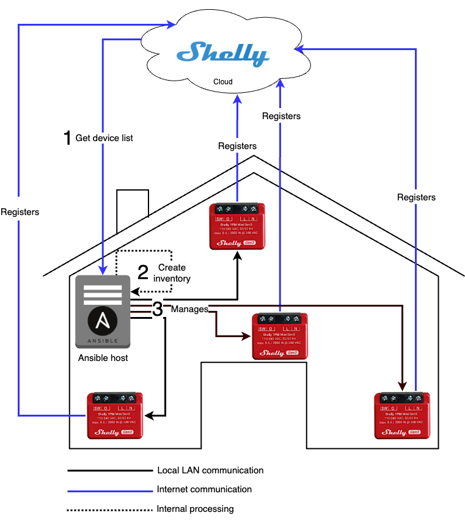

# Ansible Collection - denismaggior8.shelly_collection

## Prerequisites

- ansible core 2.17.0
- python 3.11.0

# Collection installation and removal

To install this collection (latest version) from Ansible Galaxy:

```console
$ ansible-galaxy collection install denismaggior8.shelly_collection
```

To install this collection from its GitHub repo (main branch):

```console
$ git clone https://github.com/denismaggior8/shelly_collection
$ ansible-galaxy collection install shelly_collection
```

To uninstall this collection:

```console
$ rm -rf ~/.ansible/collections/ansible_collections/denismaggior8/shelly_collection/
```

## Use the dynamic inventory plugin 

The **shelly_inventory_plugin** is used to populate a dynamic Ansible inventory getting data from Shelly Cloud. All devices, will be managed by Ansible on the local LAN.



Verify if the inventory plugin is installed:

```console
$ ansible-doc -t inventory -l 2> /dev/null | grep shelly
```

An output like this, indicates that the collection (and the inventory plugin) is found on your system:

```
Found installed collection denismaggior8.shelly_collection:1.0.0 at '~/.ansible/collections/ansible_collections/denismaggior8/shelly_collection'
denismaggior8.shelly_collection.shelly_inventory_plugin Returns a dynamic h...
```

Create the plugin configuration file (make sure you substitute the placeholders marked with \<\> with actual values):

```console
$ cat << 'EOF' > shelly_inventory_plugin.yaml
---
plugin: denismaggior8.shelly_collection.shelly_inventory_plugin
auth_key: <YOUR SHELLY CLOUD AUTHENTICATION KEY>
url_prefix: <YOUR SHELLY CLOUD REST API PREFIX (i.e. shelly-6-eu)>
EOF 
```

Test the inventory plugin:

```console
$ ansible-inventory --inventory $PWD/shelly_inventory_plugin.yaml --list -v -v -v
```

An inventory JSON document containing all your Shelly devices (grouped by category, type, room_id, etc) should appear.

## Support

Found it useful/funny/educational? Please consider to [](https://www.buymeacoffee.com/denismaggior8)
